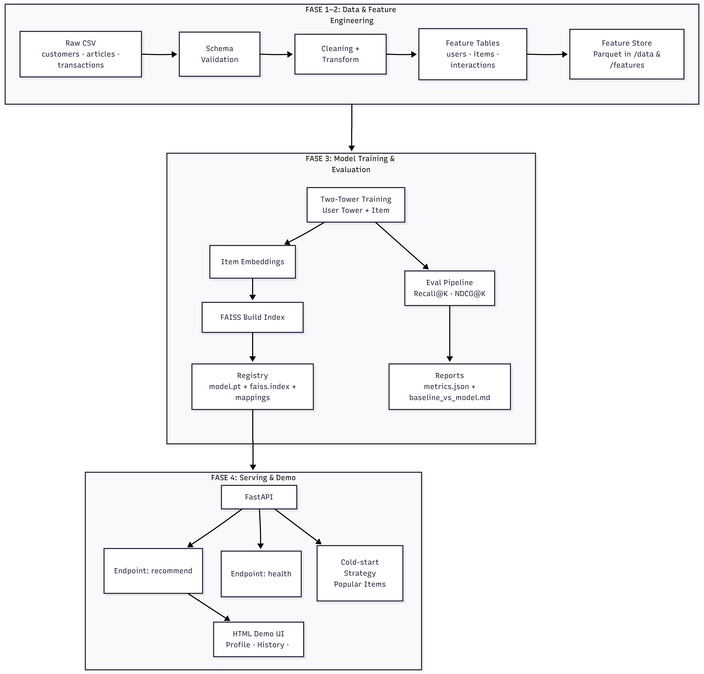

# End-to-End System Storytelling 📘

This document presents the **complete narrative** of the H&M Personalized Fashion Recommendation System, explaining the motivation, design decisions, and how all components connect from data ingestion to model serving and demo visualization.

---

## 🎯 Problem Context

Fashion retail platforms operate with:
- extremely large product catalogs
- sparse and implicit user interaction data
- strong expectations for fast and relevant recommendations

A practical recommendation system must balance **personalization, scalability, and simplicity**, while remaining interpretable and reproducible.

---

## 🧭 Design Philosophy

The system is designed with the following principles:
- **retrieval-first architecture** for scalability
- clear separation between data, model, and serving layers
- reproducibility over ad-hoc experimentation
- realistic trade-offs aligned with production systems

Rather than maximizing model complexity, the focus is on **end-to-end system clarity** and maintainability.

---

## 🏗️ System Architecture

The system follows a **modular, phase-based architecture** that mirrors a realistic machine learning production pipeline.

At a high level, the architecture is divided into four major phases:

### FASE 1–2: Data & Feature Engineering
Raw H&M retail data consisting of customers, articles, and transactions is ingested and processed through a structured pipeline.  
This phase includes schema validation, data cleaning, and feature transformation.

The outputs are:
- user feature tables
- item feature tables
- interaction tables

All features are stored as **Parquet-based feature stores**, enabling consistent reuse during both training and inference.

---

### FASE 3: Model Training & Evaluation
The core recommendation model is a **Two-Tower retrieval model**, where:
- the user tower learns representations from historical purchase behavior
- the item tower learns representations of fashion products

After training:
- item embeddings are precomputed
- embeddings are indexed using **FAISS** for efficient approximate nearest-neighbor search

Model performance is evaluated offline using **Recall@K** and **NDCG@K**, with a time-aware data split to better approximate real-world usage.

Trained model artifacts, FAISS indexes, ID mappings, and evaluation results are stored in a **model registry** for reproducibility.

---

### FASE 4: Serving & Demo
The trained model is served through a **FastAPI backend**.

The serving layer:
- loads model artifacts and FAISS index at startup
- exposes clean inference endpoints
- applies a cold-start fallback strategy based on popular items

A lightweight **HTML-based demo UI** allows users to:
- inspect customer profiles
- view recent purchase history
- explore personalized recommendation outputs

This setup enables full end-to-end system validation in a local environment.

---

## 🗂️ Data to Features

The pipeline begins with raw H&M datasets:
- customers
- articles
- transactions

These sources are transformed into structured feature tables through ETL processes, forming a shared feature store used consistently across all downstream stages.

This separation ensures **data consistency and reproducibility**.

---

## 🧠 Model and Retrieval

The recommendation engine is built around a **Two-Tower retrieval paradigm**.

Key characteristics include:
- independent encoding of users and items
- learning from implicit feedback signals
- similarity-based relevance scoring in a shared embedding space

This approach allows the system to scale efficiently while maintaining personalization quality.

---

## 📊 Evaluation and Analysis

Model evaluation is performed offline using ranking-based metrics:
- Recall@K
- NDCG@K

Results are analyzed through:
- comparison against a popularity-based baseline
- qualitative inspection of recommendation behavior

Detailed metrics and comparisons are documented in the **ml/reports** directory.

---

## 🔌 Serving and Demo Experience

The serving layer bridges the trained model with user interaction.

Key responsibilities include:
- handling inference requests
- managing cold-start scenarios
- delivering results to the demo interface

The demo UI is intentionally simple and marketplace-like, focusing on **system behavior rather than visual complexity**.

---

## ⚖️ Trade-Offs and Limitations

Several deliberate trade-offs were made:
- offline evaluation instead of online experimentation
- static embeddings instead of real-time updates
- single-stage retrieval instead of multi-stage ranking

These choices prioritize **system transparency, robustness, and clarity** over maximum theoretical performance.

---

## 🔮 Future Direction

The system provides a strong foundation for future extensions, including:
- multi-stage recommendation pipelines
- online feedback integration
- richer feature representations
- public-facing deployment

These improvements can be introduced incrementally without redesigning the core architecture.

---

## 🏁 Closing Summary

This project demonstrates how a **modern recommendation system** can be built as a coherent, end-to-end pipeline:
- grounded in real-world data
- guided by clear engineering decisions
- designed with practical constraints in mind

The result is a **portfolio-grade machine learning system** that emphasizes structure, scalability, and real-world applicability over isolated model performance.
