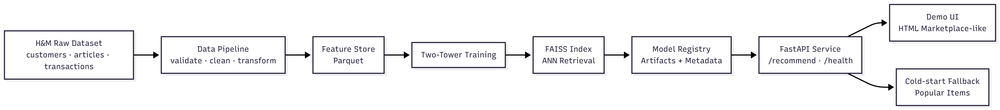

# H&M Personalized Fashion Recommendation System

An end-to-end personalized fashion recommendation system built using real-world H&M retail data.  
This project demonstrates how a modern retrieval-based recommender system can be designed, trained, evaluated, and served in a production-oriented setup.

---

## 🎥 Demo (Local)

**Demo GIF – Local Deployment**  


The demo showcases:
- Loading a customer profile
- Displaying recent purchase history
- Generating personalized recommendations
- Handling cold-start users via fallback strategy

---

## 📌 Project Overview

Large fashion retailers face challenges such as sparse user interaction data, massive product catalogs, and low-latency requirements for real-time recommendations.

This project addresses those challenges by implementing a Two-Tower retrieval-based recommendation system combined with FAISS for efficient nearest-neighbor search. The system is exposed through a FastAPI backend and demonstrated via a lightweight HTML marketplace-like user interface.

---

## 🏗️ System Architecture

**High-Level Architecture Diagram**  



### Architecture Explanation

The system is designed as a modular end-to-end pipeline:

1. Raw Data  
   H&M datasets containing customers, articles, and transactions.

2. Data Pipeline (FASE 1–2)  
   Schema validation, data cleaning, and transformation to generate feature tables.

3. Feature Store  
   Processed features stored as Parquet files for reuse during training and inference.

4. Model Training (FASE 3)  
   A Two-Tower model learns user and item embeddings. Item embeddings are indexed using FAISS for approximate nearest-neighbor retrieval, while offline evaluation is performed using ranking metrics.

5. Model Registry & Reports  
   Trained model artifacts, FAISS index, ID mappings, and evaluation reports are stored for reproducibility and analysis.

6. Serving & Demo (FASE 4)  
   FastAPI exposes recommendation and health-check endpoints. A cold-start fallback strategy based on popular items is applied, and results are visualized through an HTML marketplace-like demo UI.

---

## 🧠 Machine Learning Approach

- Model Type: Two-Tower Retrieval Model  
- Interaction Signal: Implicit feedback (purchase history)  
- Retrieval Engine: FAISS (Approximate Nearest Neighbor)  
- Cold-Start Strategy: Popular-item fallback  
- Evaluation Metrics: Recall@K, NDCG@K

This design enables scalable and personalized recommendations with low inference latency.

---

## 🔌 API Endpoints

### GET /health
Returns service and model health status.

### POST /recommend
Generates personalized product recommendations.

Request payload:
- customer_id
- top_k

The response includes recommended item identifiers, similarity scores, and a cold-start indicator when applicable.

---

## 🖥️ Demo UI

The demo UI is implemented using HTML templates and provides:
- Customer profile overview
- Recent transaction history
- Personalized recommendation results

The interface is intentionally designed to resemble a simple fashion marketplace for intuitive exploration.

---

## 📁 Project Structure
```
ml_hm_project/
├─ README.md
├─ data/                     Feature store (Parquet)
├─ features/                 Feature engineering helpers
├─ ml/
│  ├─ recommender/           Training, inference, evaluation
│  ├─ registry/              Model artifacts and metadata
│  └─ reports/               Metrics and analysis
├─ app/                      FastAPI service
├─ demo_ui/                  HTML demo UI
├─ ops/                      Pipeline and runner scripts
└─ docs/                     Detailed documentation and diagrams
```
---

## ▶️ Running the Project (Local)

The system can be executed locally by running the data pipeline, training the model, and starting the FastAPI service. The demo UI is accessed through the local server.

---

## 🔮 Future Improvements

- Public deployment with appropriate cloud resources
- Two-stage recommendation (retrieval and ranking)
- Online feedback loop and continuous learning
- Session-aware or sequential recommendation models
- Improved monitoring and scalability

---

## 📖 Documentation

Additional documentation is available in the docs directory, covering data understanding, ETL processes, model design, serving strategy, and end-to-end storytelling.

---

## 🏁 Final Note

This project is built as a portfolio-grade machine learning system, focusing on end-to-end system design, realistic constraints, and clear engineering decisions.
